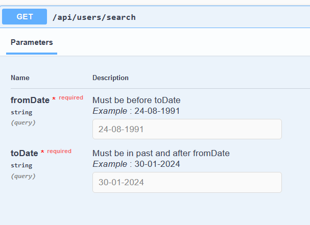
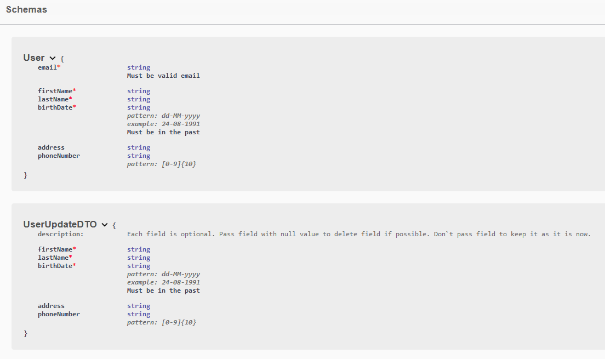
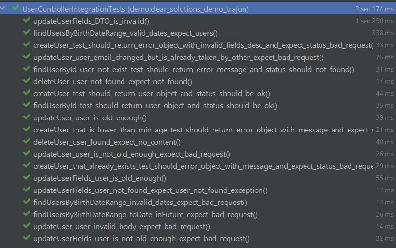
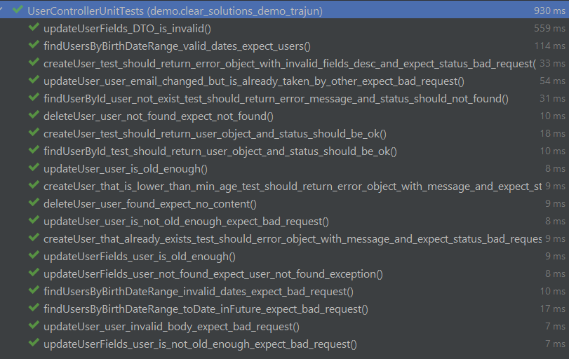

# Java practical test assignment for Clear Solutions by [NeNaO4ke](https://github.com/NeNaO4ke)


### How to launch

* Via docker - ``docker build -t cleasol/demo .`` then ``docker-compose up -d``
* Via test class ``TestClearSolutionsDemoTraJunApplication`` that will use Testcontainers for MongoDb(Docker required)
* Via ``./mvnw spring-boot:run`` (Mongo accessible at localhost:27017 required in any way)

### Documentation for api is accessible at [swagger ui page](http://localhost:8080/webjars/swagger-ui/index.html) (app must be launched)




### Requirements notes

1. Field Email treated as id(key) for db
2. 2. Updating one or some field implemented via DTO class that duplicates all fields except @Id, but they are wrapper in `Optional<T>`. Using this approach have benefits in reduced payload size - we need to pass only fields we need to update; reduced validation time; we can be easily distinct between deleting, updating or leaving field as is. 
    3. However, we still can update @Id field `email` by updating whole `User` via `PUT` request. But only if email is valid and email is not taken by other user.
3. Code is fully covered by unit tests using Mockito to mock other beans such as `UserService`. In addition, code is fully covered with integration tests that uses Testcontainers for MongoDb.

 

4. Errors handled in many ways where each comes in hand 
   1. Using `@RestControllerAdvice` for intercepting validation errors to give end user more precise knowledge about what and where and why this field is not valid
    ```
     @RestControllerAdvice
     public class RestResponseEntityExceptionHandler
                extends ResponseEntityExceptionHandler {
            @Override
            protected Mono<ResponseEntity<Object>> handleWebExchangeBindException(
                    WebExchangeBindException ex, HttpHeaders headers, HttpStatusCode status,
                    ServerWebExchange exchange) {
                List<ApiFieldErrorDetail> errorList = ex.getBindingResult().getFieldErrors()
                        .stream().map(fe -> new ApiFieldErrorDetail(fe.getField(), fe.getObjectName(), fe.getDefaultMessage()))
                        .toList();
                return handleExceptionInternal(ex, new ApiErrorDetail(ex.getBody(), errorList), headers, status, exchange);
            }
     }
     ```
   2. Using `@ResponseStatus` on Exceptions
    ```
    @ResponseStatus(value = HttpStatus.NOT_FOUND)
    public class UserNotFoundException extends Exception {
        public UserNotFoundException(String message)  {
            super(message);
        }
       
        public static UserNotFoundException fromId(String id)  {
            return new UserNotFoundException(String.format("User with email %s not found", id));
        }
    }
    ```
   3. Using `ResponseStatusException` 
   ```
   Mono.error(new ResponseStatusException(HttpStatus.BAD_REQUEST,
                           "User with id " + existingUser.getId() + " already exists.")
   ```

## [View more my projects](https://nenao4ke.github.io/portfolio/)

Especially take a look at these two projects 
1. [ATM](https://github.com/NeNaO4ke/ATM_MOOP) - very well documented project about ATM and online banking. Projects supplied with rest documentation generated via integration tests and diagrams for relationship db hierarchy and UI. Special focus on Hibernate, Quartz, Transaction API.
2. [Micro-medium](https://github.com/NeNaO4ke/micro-medium) - microservice project that use many other tools and products for logging, deploying, messaging and other.
